# AWS Certified Cloud Practitioner Certification - My Notes

## Deployment Models for Cloud Computing

- Cloud-Based Deployment
- On-Premises Deployment
- Hybrid Deployment

## Benefits of Cloud Computing

- **Trade upfront/capital(CAPEX) expense for/with variable/operational(OPEX) expense**
    - Instead of having to invest heavily in data centers and servers before you know how you’re going to use them, you can pay only when you consume computing resources, and pay only for how much you consume.
- **Stop spending money to run and maintain data centers**
    - Focus on projects that differentiate your business, not the infrastructure. Cloud computing lets you focus on your own customers, rather than on the heavy lifting of racking, stacking, and powering servers.
- **Stop guessing capacity**
    - Eliminate guessing on your infrastructure capacity needs. When you make a capacity decision prior to deploying an application, you often end up either sitting on expensive idle resources or dealing with limited capacity.
    - With cloud computing, these problems go away. You can access as much or as little capacity as you need and scale up and down as required with only a few minutes’ notice.
- **Benefit from massive economies of scale**
    - By using cloud computing, you can achieve a lower variable cost than you can get on your own. Because usage from hundreds of thousands of customers is aggregated in the cloud, providers such as AWS can achieve higher economies of scale, which translates into lower pay as-you-go price.
- **Increase speed and agility**
    - In a cloud computing environment, new IT resources are only a click away, which means that you reduce the time to make those resources available to your developers from weeks to just minutes.
    - This results in a dramatic increase in agility for the organization since the cost and time it takes to experiment and develop is significantly lower.
- **Go global in minutes**
    - Easily deploy your application in multiple regions around the world with just a few clicks. This means you can provide lower latency and a better experience for your customers at minimal cost.

## Design principles AWS in the cloud

- Perform operations as code
- Make frequent, small
- reversible changes
- Refine operations procedures frequently
- Anticipate failure
- learn from ops failures

## AWS Shared Responsibility Model

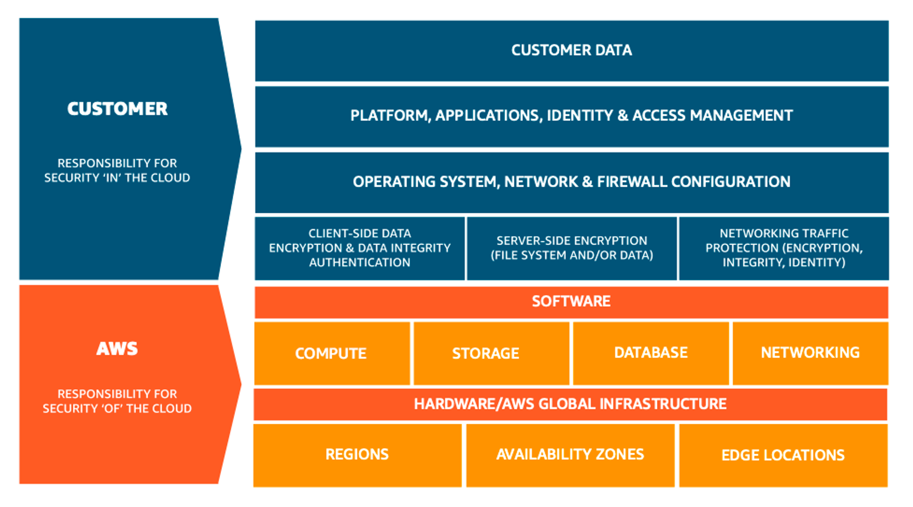

## Amazon EC2 Instance Types

- **General Purpose instances**:
    - Balanced computing, memory, and networking.
    - Suitable for web servers, dev environments, and medium databases.
- **Compute-optimized instances**:
    - High vCPUs to memory ratio.
    - Ideal for scientific modeling, batch processing, gaming server
- **Memory-optimized instances**:
    - Designed for large in-memory processing.
    - Perfect for in-memory databases and real-time big data analytics.
- **Accelerated computing instances**:
    - Uses hardware accelerators like GPUs.
    - Targeted at machine learning, video processing, high-performance computing.
- **Storage optimized instances**:
    - High sequential read/write access.
    - Great for distributed file systems and data warehousing.

## AWS EC2 Instance Store

An *instance store* provides temporary block-level storage for your instance. This storage is located on disks that are physically attached to the host computer. Instance store is ideal for temporary storage of information that changes frequently, such as buffers, caches, scratch data, and other temporary content. It can also be used to store temporary data that you replicate across a fleet of instances, such as a load-balanced pool of web servers.

## Amazon EC2 Pricing

### On-Demand

- It is ideal for short-term, irregular workloads that cannot be interrupted
- No upfront costs or minimum contract apply
- Pay-as-you-go pricing model

### Reserved instances

- Standard Reserved Instance
- Convertible Reserved Instance

### EC2 Instance saving plans

- Commitment Duration and Flexibility
- Instance Family and Sizes
- Instance Flexibility
- Regional and Zonal Options
- Shared Usage
- 1-year or 3-year term

### Spot instance

- Interruptions are possible
- %90 discount

### Dedicated host

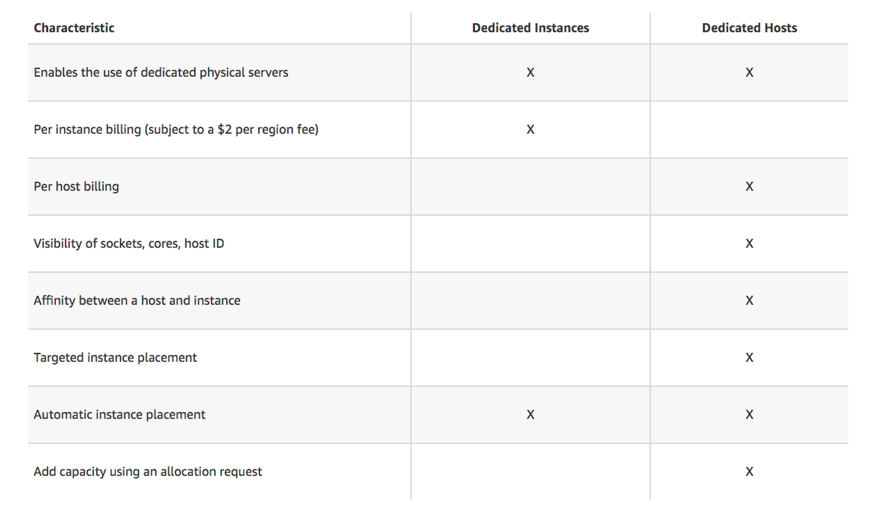

- Isolation and Compliance
- Instance Placement Control
- Instance Type Flexibility
- Cost Predictability
- Visibility and Reporting

## AWS Services

- **AWS Management Console**:
    - Web-based user interface.
    - Allows users to manage AWS services through a browser.
    - Intuitive graphical interface with organized dashboard.
    - Suitable for those who prefer a GUI-based interaction.
- **AWS CLI (Command Line Interface)**:
    - Provides direct commands for AWS services.
    - Can be used on Windows, Mac, and Linux.
    - Suitable for scripting and automation.
    - Offers deep functionality and control over services.
- **AWS SDK (Software Development Kit)**:
    - Provides libraries in multiple programming languages.
    - Enables developers to integrate AWS services into their applications.
    - Contains tools, documentation, and sample code.
    - Allows for application-level management and automation of AWS resources.

## AWS Cloud9

- It is a cloud-based integrated development environment (IDE).
- Provides access via browser to write, run and debug code.
- It comes integrated with AWS services and it is possible to manage AWS resources directly from the Cloud9 IDE.

## VPC

- **Internet Gateway (IGW)**:
    - Connects a VPC to the internet.
    - Allows instances in the VPC to directly communicate with the internet.
    - Essential for a public subnet in a VPC to send/receive traffic to/from the internet.
- **Virtual Private Gateway (VGW)**:
    - Endpoint for connecting a VPC to a VPN or AWS Direct Connect.
    - Establishes connectivity between AWS and on-premises data centers or other remote networks.
- **VPC Peering**:
    - Allows direct network connectivity between two VPCs.
    - VPCs can be in the same AWS account or different accounts.
    - Ensures private, high-speed communication between VPCs without routing traffic through the internet.
- **AWS Direct Connect**:
    - Dedicated network connection from on-premises to AWS.
    - Bypasses the public internet for more consistent network performance.
    - Can reduce network costs, increase bandwidth, and provide a more consistent network experience than internet-based connections.
    - without public internet
- **NAT Gateway**:
    - Allows instances in a private subnet to initiate outbound traffic to the internet.
    - Prevents unsolicited inbound traffic from reaching those instances.
    - Used for scenarios where instances need to download patches, updates, etc., but should not be directly accessed from the internet.
    - Managed by AWS
- **NAT Gateway vs NAT Instance**
    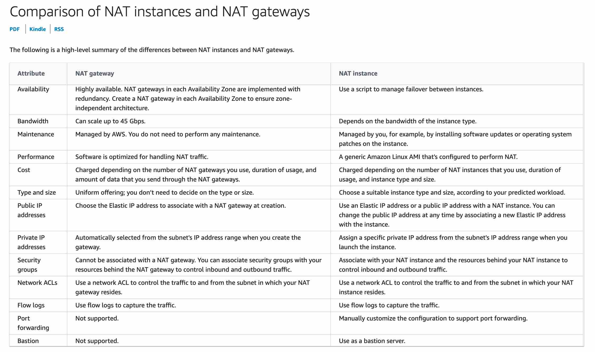

    

## Subnets

- A **private subnet** is a segment of an Amazon Virtual Private Cloud (VPC) that does not have direct internet access, making it suitable for hosting resources requiring enhanced security or internal communication within the VPC.
- A **public subnet** is a segment of an Amazon Virtual Private Cloud (VPC) that is accessible from the internet, allowing resources deployed within it to have direct internet connectivity, making it suitable for web servers or applications that require external access.

## Security Groups vs Network ACLs (NACL)

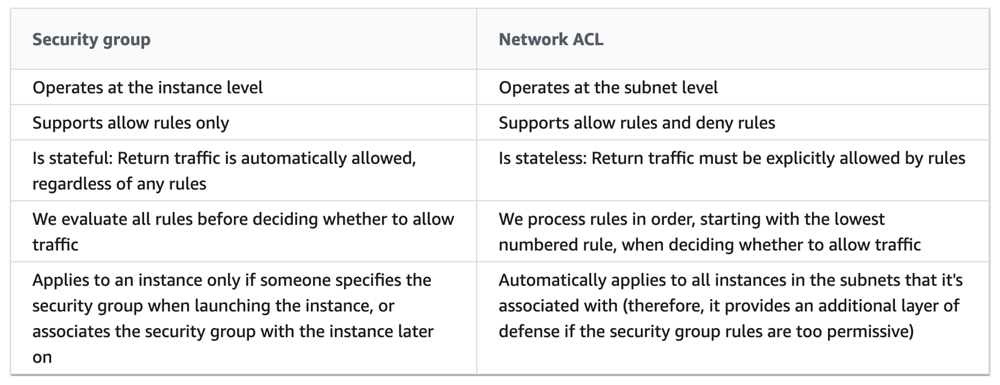

## Security Group

- Instance-Level Security
- Stateful
- Allow Rules Only
- No Rule Numbers
- Dynamic and Easy
- Permissive to Restrictive
- **Services:** EC2, RDS, ElastiCache, Redshift, DocumentDB, Lambda, Neptune, EFS, Elastic MapReduce, WorkSpaces, AppStream, Glue, Snow Family, ELB, VPC Endpoints
- **Security groups accept IP address, IP address range, and security group ID as either source or destination of inbound or outbound rules.**

## Network ACLs (NACL)

- Traffic Filtering
- Stateless
- Ordered Rules
- Numerical Rule Numbers
- Subnet Association
- **Services:** S3, EC2, RDS, RedShift, ElastiCache, EFS, DocumentDB, Neptune, EMR, VPC Endpoints

## Amazon Elastic Block Store (EBS)

- EBS provides block-level storage for EC2 instances.
- Offers various volume types for different IOPS (Input/Output Operations Per Second) requirements.
- Volume data is automatically replicated to several physical drives, increasing durability.
- EBS snapshots provide data protection by creating backups (snapshots) in S3.
- Has the ability to optionally enlarge or change volumes. (auto scale)
- **Amazon EBS pricing includes three factors: volumes, snapshots, data transfer**
- **It is not a regional service**

## Amazon Elastic File System (EFS)

- It is a scalable and easy to manage file storage service on AWS.
- Can be shared simultaneously by multiple EC2 instances, making it suitable for multi-server workloads.
- It is elastic and the storage capacity automatically increases or decreases according to your files.
- It has high durability and usability; files are automatically replicated across multiple Availability Zones.
- It comes with POSIX-compliant file system semantics, which makes it suitable for many applications.
- It is a regional service.
- Costs each write and read.

## AWS S3 Storage Classes

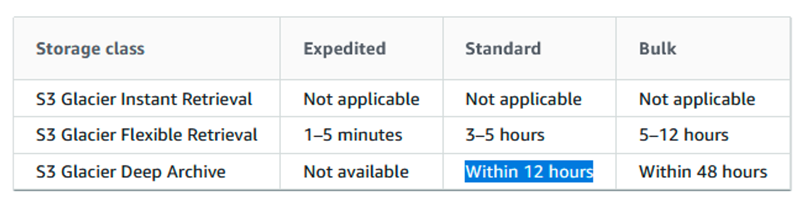

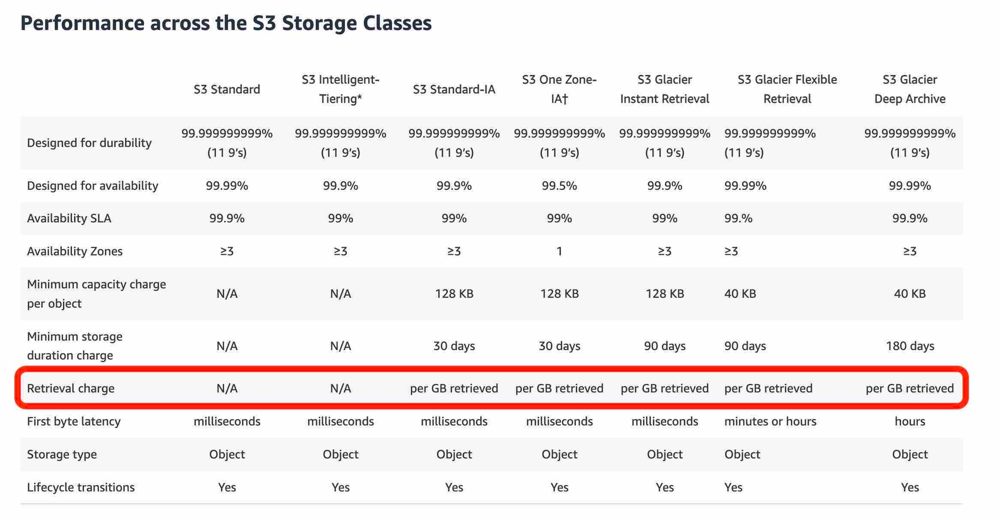

**S3 Standard:**

- General-purpose storage class.
- Provides high durability and fast data access.
- Suitable for frequently accessed and frequently updated data.
- Stores data in a minimum of three Availability Zones
- Host static website

**S3 Standard-Infrequent Access (S3 Standard-IA):**

- Ideal for infrequently accessed data
- Similar to Amazon S3 Standard but has a lower storage price and higher retrieval price
- Requires a minimum storage duration of 30 days.
- Long-term storage, backup

**S3 One Zone-Infrequent Access (S3 One Zone-IA):**

- Stores data in a single AWS Availability Zone for cost savings.
- Suitable for less frequently accessed data.
- Requires a minimum storage duration of 30 days.
- Can be preferred for backups or data that can be recreated.

**S3 Intelligent-Tiering:**

- Ideal for data with unknown or changing access patterns
- Requires a small monthly monitoring and automation fee per object

**S3 Glacier Instant Retrieval:**

- Used for archiving purposes.
- Provides fast data retrieval but at a higher cost.
- Works well for archived data that requires immediate access
- Can retrieve objects within a few milliseconds

**S3 Glacier Flexible Retrieval:**

- Low-cost storage designed for data archiving
- Able to retrieve objects within a few minutes to hours

**S3 Glacier Deep Archive:**

- Lowest-cost archival storage class.
- Suitable for long-term archiving and rarely accessed data.
- Provides data retrieval within 12 to 48 hours.

**S3 Outposts:**

- S3 run on-premises using AWS Outposts service.
- Provides access to AWS services in your local data center.
- Offers local storage to keep storage costs low.

<aside>
💡 Amazon S3 Transfer Acceleration helps to read and write data to Amazon S3 over long geographic distances with low latency.
</aside>

## S3 pricing is based on four factors

1. Total amount of data (in GB) stored on S3
2. Storage class (S3 Standard, S3 Intelligent-Tiering, S3 Standard-Infrequent Access, S3 One Zone-IA, S3 Glacier, or S3 Glacier Deep Archive)
3. Amount of data transferred out of AWS from S3
4. Number of requests to S3

## Amazon S3 Policies

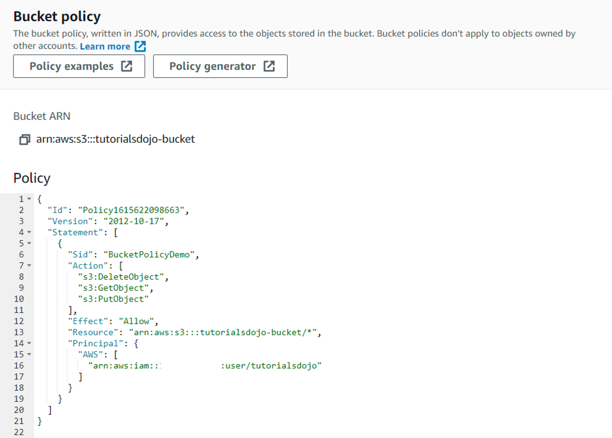

- **Action***: Specifies S3 operations that are allowed or denied (e.g. s3:PutObject, s3:GetObject).
- **Effect***: Indicates the permission decision; usually takes the values "Allow" or "Deny".
- **Resource**: Identifies the S3 resources (bucket or object) to which permission is applied or not.
- **Principal**: Specifies the AWS accounts or users to which the permission policy applies.
- **Sid (Optional)** – Include an optional statement ID to differentiate between your statements.
- **Condition (Optional)** – Specify the circumstances under which the policy grants permission.

## Amazon Relational Database Service (RDS)

- Managed Databases
- **Multiple Database Engines:** It supports various database engines like MySQL, PostgreSQL, Oracle, SQL Server, and MariaDB.
- **Automated Backups:** enabling point-in-time recovery.
- **Scalability:** Easily scale compute and storage resources to handle increased demand.
- **High Availability:** Multi-AZ deployment provides failover capability for enhanced availability.
- AWS managed Amazon Relational Database Service (Amazon RDS) instance performance is better than a customer managed database instance

**AWS is responsible for:**

- Managing the underlying infrastructure and foundation services.
- Managing the operating system.
- Database setup.
- Patching and backups.

**The customer is still responsible for:**

- Protecting the data stored in databases (through encryption and IAM access control).
- Managing the database settings that are specific to the application.
- Building the relational schema.
- Network traffic protection.

## AWS Database Migration Service (DMS)

- AWS DMS allows you to easily move your databases to the AWS cloud, from AWS to other platforms, or between different database types.
- Supports both heterogeneous (e.g., Oracle to MySQL) and homogeneous (e.g., MySQL to MySQL) database migrations.
- It allows you to migrate with minimal interruption by ensuring that your source database continues to operate during migration.
- It also facilitates data synchronization between the source and target database by continuously replicating database data.
- When used with AWS Schema Conversion Tool, it helps you automatically convert database schemas from one database platform to another.

## **AWS Identity and Access Management (IAM)**

IAM gives you the flexibility to configure access based on your company’s specific operational and security needs. You do this by using a combination of IAM features, which are explored in detail in this lesson:

- IAM users, groups, and roles
- IAM policies
- Multi-factor authentication
1. **User**:
    - Directly associated with an identity in an AWS account.
    - It can directly access AWS services with its own access keys and passwords.
    - Usually created for real people or applications.
    - These users can be assigned specific permissions or certain policies can be applied to them.
    - For example, you can create an AWS user for an application and give that user access only to the S3 bucket.
2. **User Group**:
    - Used to organize and manage multiple AWS users.
    - Ideal for grouping users with common permissions.
    - A policy or permission assigned to a group is automatically assigned to all users in that group.
    - For example, if you want to give the same access permissions to all developers, you can group them in a single "Developer" group.
3. **Role**:
    - It is not directly associated with an ID or password, so it cannot be used to log in directly.
    - It is used to transfer permissions to another AWS service or user for a certain period of time.
    - It is frequently used to grant applications running on EC2 instances access to AWS services that these instances need.
    - When an AWS service needs access to another service, a role is used to provide this access securely.
    - For example, if you want an EC2 instance to write data to the S3 bucket, you can create a role for this EC2 instance and grant S3 write permissions to this role.

## Root User

- Create, manage, and close AWS accounts.
- Create and manage IAM (Identity and Access Management) users and groups.
- Create and manage IAM roles.
- Provide full access to all AWS services and resources.
- Manage billing, payments, and account details.
- Modify security settings and IAM policies.
- Manage security and auditing services like AWS CloudTrail and AWS Config.
- Change account name

## AWS Artifact

- AWS Artifact aims to provide access to **security and compliance documentation** and reports for AWS accounts. You can use these documents to support security controls and compliance requirements.
- AWS Soc & PCI reports download

## AWS GuardDuty

- GuardDuty is used to automatically detect **malicious activities and threats** in your AWS accounts.
- Monitors security threats using **anomaly-based detection** techniques and provides **real-time** alerts.
- Can detect threats such as identity theft, network attacks and behavioral analysis.
- Quickly detects potential threats with threat data and behavioral analysis.

## AWS Shield

- Prevents DDOS attack
- AWS Shield which protects against Distributed Denial of Service (DDoS) attacks is available globally on Amazon CloudFront Edge Locations.
- Amazon EC2, Elastic Load Balancing (ELB), Amazon CloudFront, Amazon Route 53, AWS Global Accelerator provide automatic ddos protection.

## AWS WAF

- Web Application Protection
- Rule Creation
- Rate Limiting
- Managed Rules
- Real-time Metric
- Global Reach
- Block IP Addresses
- SQL Injection
- Provides protection at Layer 7

## Layers

- **Layer 3** - Layer 3 is the Network layer and this layer decides which physical path data will take when it moves on the network. AWS Shield offers protection at this layer.
- **Layer 4** - Layer 4 is the Transport layer and this layer data transmission occurs using TCP or UDP protocols. AWS Shield offers protection at this layer.
- **Layer 7 -** HTTP and HTTPS requests are part of the Application layer, which is layer 7.

## Customer Compliance Center

- AWS answers to key compliance questions
- An overview of AWS risk and compliance
- An auditing security checklist

## Amazon CloudWatch

- Monitoring and management service for AWS resources.
- Collects and tracks metrics, logs, and events.
- Provides insights into application and infrastructure performance.
- Enables automated actions based on defined alarms.
- Amazon CloudWatch logs are encrypted by default using AWS Key Management Service (KMS).
- CloudWatch Logs allows you to collect and store logs from your AWS infrastructure in a central location, Logs Streams represent source-based sequential streams of these logs. CloudWatch Logs Insights is a query and analysis tool that makes it easier for you to dive deeper into these logs and analyze them.

## AWS CloudTrail

- Logging and auditing service for AWS accounts.
- Records API calls and actions made within your account.
- Provides a trail of events for security and compliance analysis.
- Helps in tracking changes, identifying potential security risks, and troubleshooting.

## AWS Trusted Advisor

- Provides best practice recommendations to help optimize your AWS resources.
- Offers control in four categories: cost optimization, performance, security and fault tolerance.
- Helps reduce operating costs, improve performance and keep systems safe.
- Provides the ability to directly perform suggested actions by clicking on specific suggestions.
- Provides some basic checking for free for all AWS customers, but Business or Enterprise support plans may be needed for further advice.
- Detects security vulnerabilities.
- Helps you optimize your AWS accounts to reduce costs.
- Monitors service quotas and warns when they are exceeded.
- Can monitor in real time and give suggestions.

## AWS Billing Dashboard

- Compare your current month-to-date balance with the previous month, and get a forecast of the next month based on current usage.
- View month-to-date spending by service.
- View Free Tier usage by service.
- Access Cost Explorer and create budgets.
- Purchase and manage Savings Plans.

## AWS **Consolidated Billing**

- One bill
- Easy tracking
- No extra fee
- **Combined usage** – You can combine the usage across all accounts in the organization to share the volume pricing discounts, Reserved Instance discounts, and Savings Plans. This can result in a lower charge for your project, department, or company than with individual standalone accounts.

## AWS Budgets

- Monitoring and cost management service in AWS.
- Helps track and manage spending on AWS resources.
- Set custom spending limits and receive alerts when thresholds are reached.
- Provides real-time insights into usage, costs, and forecasts.
- Enables proactive cost control and optimization.

## AWS Pricing Calculator

- Online tool to estimate AWS service costs.
- Helps plan and budget for AWS usage.
- Offers a user-friendly interface to configure services and resources.
- Provides cost breakdowns based on selected configurations.
- Allows comparison of different pricing options.
- Aids in understanding potential expenses before deploying resources.

## AWS Cost and Usage Report (CUR)

- The **Cost and Usage Report** is your one-stop shop for accessing the most granular data about your AWS costs and usage. You can also load your cost and usage information into Amazon Athena, Amazon Redshift, AWS QuickSight, or a tool of your choice.
- Access comprehensive AWS cost and usage information
- Track your Amazon EC2 Reserved Instance (RI) usage
- Leverage strategic data integrations
- Usage and view the discounted RI rate
- Used to analyze AWS costs and usage in detail.
- Can create hourly detailed reports and store these reports in S3 bucket.
- Helps you track, analyze and plan AWS costs.
- Allows analysis by tags.

## AWS Cost Explorer

- **Cost analysis and visualization tool in AWS.**
- Provides detailed insights into AWS usage and spending.
- Allows filtering and grouping of cost data based on various dimensions.
- Offers historical and forecasted cost information.
- Helps in optimizing costs and making informed decisions.
- **Comments about the future by looking at the past.**
- Monthly expenses can be visualized
- Can calculate estimated expenses for 12 months with high accuracy

## AWS Support Plans

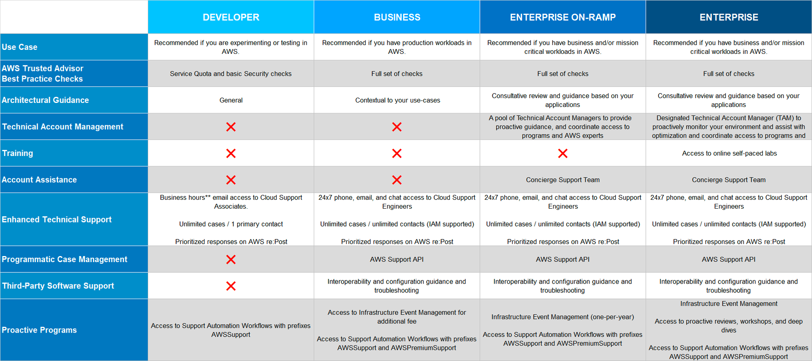

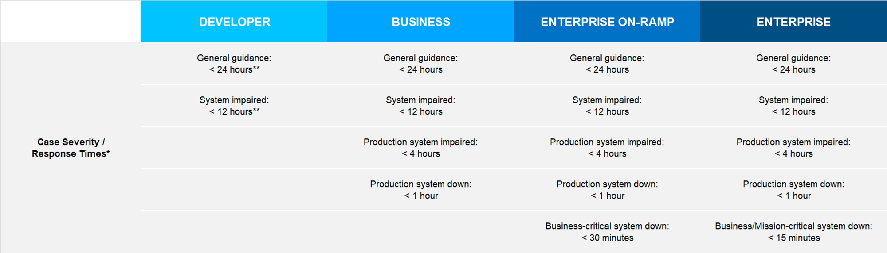

### Basic Support

- **Customer Service and Communities** - 24x7 access to customer service, [documentation](https://docs.aws.amazon.com/), [whitepapers](https://aws.amazon.com/whitepapers/), and [AWS re:Post.](https://www.repost.aws/)
- **[AWS Trusted Advisor](https://aws.amazon.com/premiumsupport/technology/trusted-advisor/)** Access to core Trusted Advisor [checks](https://docs.aws.amazon.com/awssupport/latest/user/trusted-advisor-check-reference.html) and guidance to provision your resources following best practices to increase performance and improve security.
- **[AWS Personal Health Dashboard](https://aws.amazon.com/premiumsupport/technology/personal-health-dashboard/)** - A personalized view of the health of AWS services, and alerts when your resources are impacted.
- No Technical support

### Developer Support

- Best practice guidance
- Client-side diagnostic tools
- Building-block architecture support, which consists of guidance for how to use AWS offerings, features, and services together
- Technical support within business days (12 hour response time)
- Technical support through Chat

### Business Support

- Use-case guidance to identify AWS offerings, features, and services that can best support your specific needs
- All AWS Trusted Advisor checks
- Limited support for third-party software, such as common operating systems and application stack components
- Technical support with 24/7 phone and email access (1 hour response time)
- Unlimited access to AWS Consultants
- AWS Business Priority Support Plan (ISM)
- Technical support through phone calls

### Enterprise On-Ramp Support

- A pool of Technical Account Managers to provide proactive guidance and coordinate access to programs and AWS experts
- A Cost Optimization workshop (one per year)
- A Concierge support team for billing and account assistance
- Tools to monitor costs and performance through Trusted Advisor and Health API/Dashboard
- Consultative review and architecture guidance (one per year)
- Infrastructure Event Management support (one per year)
- Support automation workflows
- 30 minutes or less response time for business-critical issues

### Enterprise Support

- A designated Technical Account Manager to provide proactive guidance and coordinate access to programs and AWS experts
- A Concierge support team for billing and account assistance
- Operations Reviews and tools to monitor health
- Training and Game Days to drive innovation
- Tools to monitor costs and performance through Trusted Advisor and Health API/Dashboard
- Consultative review and architecture guidance
- Infrastructure Event Management support
- Cost Optimization Workshop and tools
- Support automation workflows
- 15 minutes or less response time for business-critical issues
- Technical Account Manager (TAM)
- Enfrastructure Event Management (IEM) 

## Infrastructure Event Management (IEM)

- AWS's dedicated support service for large-scale events or application launches.
- AWS support engineers work closely to support the customer's AWS infrastructure in the planning, preparation and operation phases.
- Assists in scaling, configuring and optimizing infrastructure to maximize the success of the event.
- Provides in-depth monitoring and reporting during and after the incident.
- Designed specifically for launches of critical workloads or major promotions and events.

## Technical Account Manager (TAM)

- Dedicated technical advisor in AWS.
- Offers personalized support and guidance for strategic accounts.
- Helps with architectural design, optimization, and best practices.
- Assists in troubleshooting, performance improvements, and issue resolution.
- Acts as a liaison between customers and AWS support teams.
- Aims to enhance the customer's AWS experience and success.

## AWS Marketplace

AWS Marketplace is a digital catalog that includes thousands of software listings from independent software vendors. You can use AWS Marketplace to find, test, and buy software that runs on AWS.

## AWS Cloud Adoption Framework (CAF)

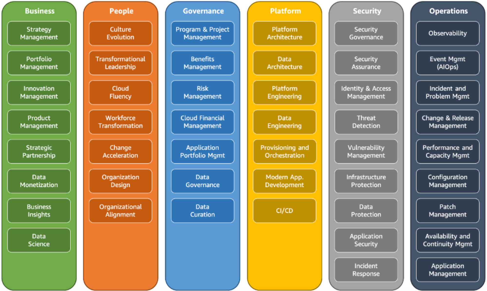

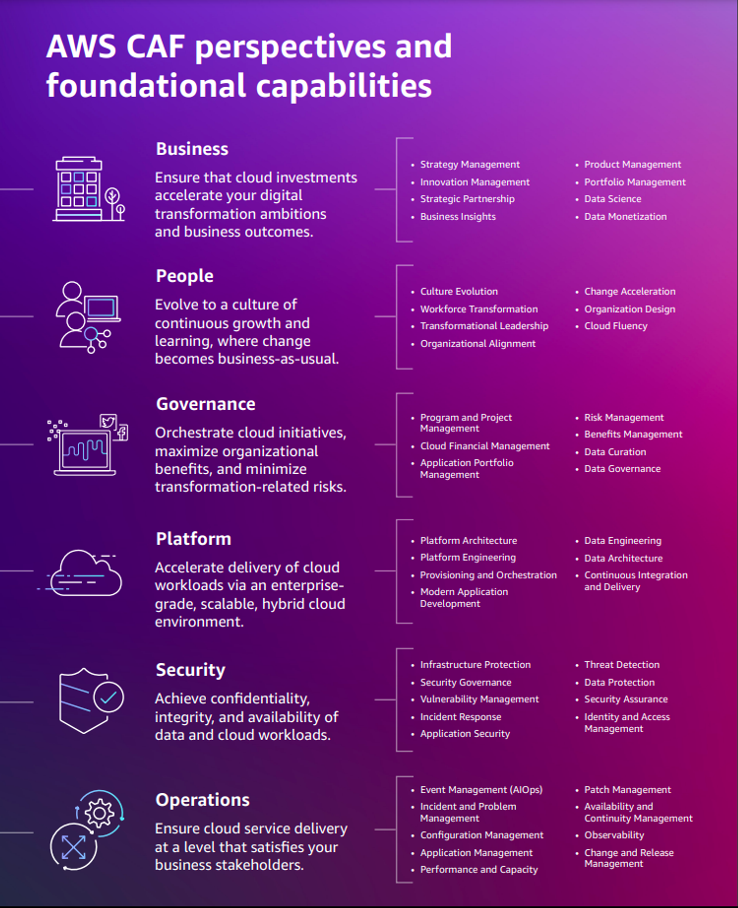

1. **Business Perspective:**
     - Purpose: Understand how business value is created and determine how cloud adoption contributes to the organization's business goals.
     - Focus Points: Business objectives, risk management, opportunities and ROI (return on investment).
2. **People Perspective:**
     - Purpose: Aligning the organization's skills and capacities with cloud services.
     - Focus Points: Training, defining new roles, building teams and continuing education and learning.
3. **Governance Perspective:**
     - Purpose: Aligning business processes and IT governance with cloud services.
     - Focus Points: Risk management, cost reduction, license management, compliance, process improvements and control mechanisms.
4. **Platform Perspective:**
     - Purpose: Design and implement cloud infrastructure and architecture in line with business needs and objectives.
     - Focus Points: Infrastructure design, service selection, architectural best practices and application migration.
5. **Security Perspective:**
     - Purpose: Meeting security and compliance requirements.
     - Focus Points: Identity and access management, data protection, network security and compliance requirements.
6. **Operations Perspective:**
     - Purpose: To manage and operate cloud resources and services effectively and efficiently.
     - Focus Points: Automation, monitoring, reporting, incident management, and continuous integration and continuous delivery (CI/CD) processes.
     -Observability
     - Event management (AIOps)
     - Incident and problem management
     - Change and release management
     - Performance and capacity management
     - Configuration management
     - Patch management
     - Availability and continuity management
     - Application management

## **6 strategies for migration**

**Rehosting** 

- Migrating applications to the Cloud as is, with minor changes.
- Also known as "lift and shift."
- Moving applications as-is to the cloud.
- Minimal changes to the application.
- Provides quick migration with minimal disruption.

**Replatforming:**

- Leveraging performance and scalability by integrating applications with the cloud. Code changes can also be made here.
- Making some optimizations during migration.
- Adapting applications to take advantage of cloud services.
- May involve some code or configuration changes.
- Improves application performance and scalability.

**Refactoring/Re-architecting:**

- Go cloud-native for maximum scalability. This involves extensive code and architectural changes.
- Redesigning applications to be cloud-native.
- Extensive code changes and architecture modifications.
- Utilizes cloud services and modern best practices.
- Offers maximum scalability, efficiency, and innovation.

**Repurchasing:**

- Replacing existing software with cloud alternatives. Manage applications with less hassle by creating SaaS.
- Replacing existing software with cloud-based alternatives.
- Adopting software-as-a-service (SaaS) solutions.
- Requires minimal development effort.
- Often results in improved features and reduced maintenance.

**Retaining:**

- Keeping existing applications in their current state because they are legacy.
- Keeping certain applications in their current state.
- Typically for applications not suitable for migration.
- Could involve legacy or proprietary software.

**Retiring:**

- Gradually removing unneeded services to reduce operational load and budget.
- Phasing out applications or services.
- Discontinuing resources that are no longer needed.
- Helps streamline operations and reduce costs.

## **AWS Snow Family Members**

**AWS Snowcone:**

- Small, rugged, and portable edge computing and data transfer device.
- Designed for collecting, processing, and transporting data from remote or disconnected environments.
- Suitable for scenarios with limited space and power constraints.
- Provides data encryption and secure transfer to AWS.
- It features 2 CPUs, 4 GB of memory, and up to 14 TB of usable storage.****

**AWS Snowball:**

- Data migration and transport device for large amounts of data.
- Available in two sizes: Snowball and Snowball Edge.
- Helps transfer data physically to and from AWS data centers.
- Suitable for offline data transfers and overcoming network limitations.
- Storage: 80 TB
- Compute: 40 vCPUs, and 80 GiB
- **Snowball Edge Storage Optimized ⇒** well suited for large-scale data migrations and recurring transfer workflows, in addition to local computing with higher capacity needs.
- **Snowball Edge Compute Optimized ⇒** provides powerful computing resources for use cases such as machine learning, full motion video analysis, analytics, and local computing stacks.

**AWS Snowmobile:**

- Massive data migration solution for exabyte-scale datasets.
- Uses a shipping container-sized data transfer truck.
- Transfers large datasets to AWS securely and efficiently.
- Designed for extremely large-scale data transfer needs.
- You can transfer up to 100 petabytes of data per Snowmobile, a 45-foot long ruggedized shipping container, pulled by a semi trailer truck.****

## AWS AI

- Get code recommendations while writing code and identify security issues in your code with Amazon CodeWhisperer.
- Convert speech to text with Amazon Transcribe.
- Identify potentially fraudulent online activities with Amazon Fraud Detector.
- Amazon Lex ⇒ Build voice and text chatbots
- Amazon Polly ⇒ Text to Speech
- Amazon Personalize ⇒ Allows developers to quickly build and deploy curated recommendations and intelligent user segmentation at scale using machine learning (ML).
- AWS Rekognition ⇒ Computer Vision
- Amazon **Comprehend** is a natural language processing (NLP) service offered by Amazon Web Services (AWS). This service analyzes text data, making it easy to gain in-depth information about content and use this data in various applications
- **Amazon Kendra** is a machine learning-powered enterprise search service from AWS. This service allows companies to easily discover their content through natural language searches.

## **The AWS Well-Architected Framework**

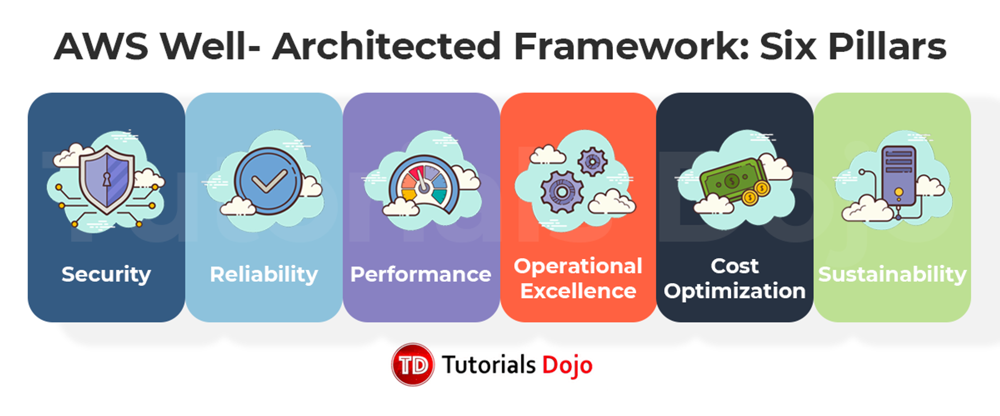

### Operational excellence

- The operational excellence pillar includes the ability to run and monitor systems to deliver business value and to continually improve supporting processes and procedures.
- Perform operations as code
- Make frequent, small, reversible changes
- Refine operations procedures frequently
- Anticipate failure
- Learn from all operational failures
- IaaS

### Security

- The security pillar includes the ability to protect information, systems, and assets while delivering business value through risk assessments and mitigation strategies.
- Implement a strong identity foundation
- Enable traceability
- Apply security at all layers
- Automate security best practices
- Protect data in transit and at rest
- Keep people away from data
- Prepare for security events

### Reliability

- The reliability pillar includes the ability of a system to recover from infrastructure or service disruptions, dynamically acquire computing resources to meet demand, and mitigate disruptions such as misconfigurations or transient network issues.
- Recover from infrastructure or service disruptions
- Dynamically acquire computing resources to meet demand
- Mitigate disruptions such as misconfigurations or transient network issues
- Testing recovery procedures
- Scaling horizontally
- Increase aggregate system availability
- Automatically recovering from failure
- Stop guessing capacity

### Performance Efficiency

- The performance efficiency pillar includes the ability to use computing resources efficiently to meet system requirements. Key topics include selecting the right resource types and sizes based on workload requirements, monitoring performance, and making informed decisions to maintain efficiency as business needs evolve.
- Architecture includes experimenting more often
- Using serverless architectures
- Designing systems to be able to go global in minutes
- Go global in minutes
- Experiment more often

### Cost Optimization

- The cost optimization pillar includes the ability to avoid or eliminate unneeded cost or sub-optimal resources.
- Adopt a consumption model
- Analyzing and attributing expenditure
- Using managed services to reduce the cost of ownership
- Implement cloud financial management

### Sustainability

- The discipline of sustainability addresses the long-term environmental, economic, and societal impact of your business activities. Your business or organization can have negative environmental impacts like direct or indirect carbon emissions, unrecyclable waste, and damage to shared resources like clean water. When building cloud workloads, the practice of sustainability is understanding the impacts of the services used, quantifying impacts through the entire workload lifecycle, and applying design principles and best practices to reduce these impacts.
- Understand your impact
- Establish sustainability goals
- Maximize utilization
- Anticipate and adopt new, more efficient hardware and software offerings
- Use managed services
- Reduce the downstream impact of your cloud workloads

## AWS Professional Services

- AWS Professional Services provides consulting and support services to help customers achieve specific business outcomes using AWS's cloud services. This service offers bespoke consulting services to help businesses optimize their migration to AWS, build new solutions in accordance with best practice guidelines, and learn how to best use AWS infrastructure. In addition to public cloud adoption, AWS Professional Services contributes to several specialized practice areas for payment.

## AWS Concierge Support

1. **Customized Support:** Provides customers with one-on-one guidance and advice on using AWS's cloud services.
2. Focused on Business Needs
3. Proactive Recommendations
4. Special Events and Trainings
5. Customer Relationship Management

## AWS Enterprise Support

1. **Comprehensive Support:** Provides support for large and complex AWS infrastructures of large enterprises.
2. 7/24 Technical Support
3. Infrastructure Event Management (IEM)
4. Technical Consultancy
5. Education and Learning
6. Access to Advanced Tools

## AWS Config

- Detects configuration changes and incompatibilities in AWS resources, thus facilitating security and compliance management.
- Saves changes in real time.
- Stores saved configurations in AWS S3.
- Visually presents the relationships between resources.
- Indicates resources that do not comply with the specified rules.
- Sends change alerts and notifications.
- Constantly checks for security and compliance.
- Allows reviewing historical configuration history.
- Accessed via AWS Management Console, AWS CLI, or SDKs.
- Generates configuration history reports for the desired time interval.

## AWS CloudEndure

- It is a disaster recovery solution offered by AWS.
- Replicates applications to cloud environments, different clouds or different regions within the same cloud.
- Offers low RTO (Target Recovery Time) and RPO (Target Recovery Point).
- Replicates application data in real time.
- Automatically converts different source types.

## AWS Security Hub

- It is AWS's central security and compliance service.
- Aggregates security alerts and check results from multiple AWS services.
- Automates security and compliance checking across AWS accounts.
- Provides information from predefined compliance standards.
- Provides users with a comprehensive view of security threats and vulnerabilities.
- Has the ability to prioritize alerts and findings.
- Works integrated with other AWS security services.
- Can react to events with customizable and automatable responses.
- Continuously monitors the security status of assets in AWS.
- Shows the security profile in your AWS environment in a central dashboard.

## AWS Proton

- Amazon Proton is AWS's fully managed deployment service for container-based and serverless applications.
- It facilitates collaboration between application owners and deployment engineers, making tasks such as creating deployment templates and automated service deployment simple and repeatable.
- Enables fast and secure deployments by automating live updates and configurations of applications and infrastructure.

## AWS Batch

- Automatically plans and executes large-scale batch processing tasks.
- Dynamically scales jobs with different CPU and memory requirements.
- It is a regional service.
- Supports cost-optimized resource allocation, i.e. selects the most appropriate EC2 resource type at affordable cost.
- It works integrated with AWS, so it can easily interact with other services.
- Automatically retries failed jobs, ensuring workloads are completed.
- Provides cost savings by using Spot Instances, so jobs can be run more economically.

## AWS Systems Manager

- Allows you to view and manage your AWS resources in a central interface.
- Capable of automatically executing operational tasks (e.g. automatic deployment of the patch).
- Provides secure access to remote EC2 instances, no password or SSH key required.
- With its configuration management feature, it allows you to protect and maintain the desired configurations.
- You can get detailed information about the systems with the ability to collect inventory at any time.
- Streamlines automation tasks between Amazon EC2 and on-premises machines.

## AWS Systems Manager - Parameter Store

- Securely stores and manages configuration data, passwords and other confidential information in a central location.
- Tracks configuration changes thanks to the version control feature.
- Provides authentication and authorization by integrating with AWS Identity and Access Management (IAM).
- Integrates with AWS Key Management Service (KMS) and ensures encryption of sensitive data.
- Allows applications and services to dynamically pull configuration data.
- Provides easy integration with other services within the AWS ecosystem.

## AWS Systems Manager - Session Manager

- Allows you to connect to EC2 instances and on-premises machines directly from the AWS Management Console without a browser-based management console or routing tools such as SSH or RDP.
- It simplifies system administrators' interaction with instances in a secure and auditable manner.
- You can record all session activities and access these records via AWS CloudTrail, providing audit traceability.
- You can control which instances users and roles can interact with with AWS Identity and Access Management (IAM) policies.
- Allows users to securely access the machine without needing open SSH/RDP ports or any other means of routing.

## AWS Systems Manager - Patch Manager

AWS Systems Manager helps you select and deploy operating system and software patches automatically across large groups of Amazon EC2 or on-premises instances. Through patch baselines, you can set rules to auto-approve select categories of patches to be installed, such as operating system or high severity patches. Systems Manager helps ensure that your software is up-to-date and meets your compliance policies.

## AWS Load Balancer

1. **Application Load Balancer (ALB)**:
     - It operates at Layer 7 (Application Layer) and is best for balancing HTTP/HTTPS traffic.
     - Application Load Balancer (ALB) supports HTTPS by default for encrypted connections.
     - Example: When your web application needs to redirect to different microservices, you can perform URL path based redirection using ALB.
2. **Network Load Balancer (NLB)**:
     - It operates at Layer 4 (Transport Layer) and is designed for TCP, UDP and TLS traffic with high performance and ultra-low latencies.
     - Example: If you have a TCP or UDP service with very high demand (e.g. an MMO game server), you can balance traffic to different server instances with NLB.
3. **Classic Load Balancer (CLB)**:
     - It can work on both layer 4 (Transport Layer) and layer 7 (Application Layer), but it is an old technology and its use in new projects is not recommended.
     - Example: If you are moving a legacy application to AWS and need a load balancer without changing your existing configuration, you can use CLB.
4. **Gateway Load Balancer (GWLB)**:
     - It operates at layer 3 (Network Layer) and is designed for network services such as virtual network equipment (VNE).
     - Example: If you have an on-premises firewall or other network equipment and plan to move them to AWS, you can route traffic to these virtual network equipment with GWLB.

## AWS GreenGrass

1. AWS Greengrass is a service designed to run cloud capabilities on local devices.
2. Greengrass enables devices to run Lambda functions locally, synchronize data, and securely communicate with each other.
3. It also supports data storage and messaging capabilities locally to be able to analyze data collected from devices and send it back to the cloud

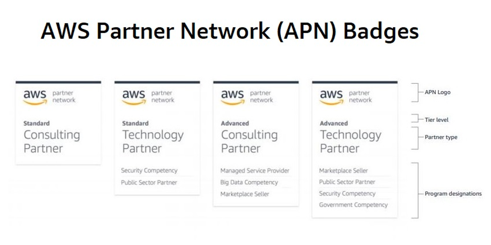

## AWS Partner Network (APN) Technology Partners

💡 **APN Technology Partners** provide software solutions that are either hosted on or integrated with the AWS platform. Technology Partners include Independent Software Vendors (ISVs), SaaS, PaaS, developer tools, management, and security vendors.

- They represent technology-based companies; such as software manufacturers, platform providers and companies offering SaaS, PaaS, IoT and security solutions.
- They develop technological products and services that complement or extend the solutions AWS offers to customers.
- They offer applications and integration tools specific to AWS infrastructure.
- They often offer their solutions to customers on AWS Marketplace.
- They have the ability to create products with deep integration with AWS.
- Technology Partners often increase their compatibility with AWS through the APN Navigate program.

## AWS Partner Network (APN) Consulting Partners

💡 **APN Consulting Partners** are professional services firms that help customers of all sizes design, architect, migrate, or build new applications on AWS. Consulting Partners include System Integrators (SIs), Strategic Consultancies, Resellers, Digital Agencies, Managed Service Providers (MSPs), and Value-Added Resellers (VARs).

- Represents companies that provide professional services; system integrators, consulting firms, agencies and other companies providing IT consulting services.
- They assist customers in using AWS; this may include services such as onboarding, training, migration and project management.
- They are experts in the implementation and integration of AWS solutions.
- They guide customers in optimizing and managing AWS costs.

## AWS Inspector

- AWS Inspector is a service that automatically evaluates the security and compliance of your applications on AWS.
- This service scans your applications and identifies potential security vulnerabilities and compatibility issues.
- Creates reports and makes suggestions about detected vulnerabilities and incompatibilities.

## AWS Athena

1. It is a serverless query service; so no infrastructure management is required.
2. It allows running SQL queries on data stored in S3.
3. The payment structure is based on the amount of data crawled by the query being run.
4. It integrates with Presto and offers ANSI SQL support, so you can create complex queries.
5. Supports CSV, JSON, ORC ...
6. It can integrate with AWS Glue, so you get data cataloging and management capabilities.

## AWS Cognito User Pool

1. Provides login and registration functions for users.
2. Allows to include social identity providers and SAML-based identities.
3. Used to manage personal details, passwords and groups.
4. Supports security features such as multi-factor authentication (MFA) and password policies.
5. Provides authentication and authorization information with JWT tokens.

## AWS Cognito Identity Pool

1. Provides temporary AWS identities to authenticated and unauthenticated users.
2. Supports merging identities from various identity providers.
3. Provides users with direct access to AWS services.
4. Cognito User Pools accept identities from social identity providers and private identity providers.
5. Offers integration with IAM roles for role-based access control.
6. Supports login with providers such as Google, Facebook.

## AWS Single Sign-On (SSO)

1. Provides access to AWS and business applications with a single sign-on.
2. Manages user access and authorization in a central location.
3. Provides SSO capabilities across multiple AWS accounts and business applications.
4. Integrates with AWS Organizations and can configure SSO for accounts across the entire organization.
5. Supports integration with third-party identity providers such as Azure AD.

## AWS AppSync

1. It is a GraphQL service that facilitates data querying and manipulation for your applications.
2. Offers real-time data synchronization and offline access features.
3. Integrates with various data sources (RDS, DynamoDB, Lambda).
4. It can automatically create data schemas and generate compatible queries.
5. Optimizes cost thanks to the pay-per-request model.

## Services permitted for testing

AWS customers are allowed to carry out security assessments and penetration tests against their AWS infrastructure without prior approval for 15 services (no need to memorize these services):

- Amazon EC2 instances, WAF, NAT Gateways, and Elastic Load Balancers
- Amazon RDS
- Amazon CloudFront
- Amazon Aurora
- Amazon API Gateways
- AWS AppSync
- AWS Lambda and Lambda Edge functions
- Amazon Lightsail resources
- Amazon Elastic Beanstalk environments
- Amazon Elastic Container Service
- AWS Fargate
- Amazon Elasticsearch
- Amazon FSx
- Amazon Transit Gateway
- S3 hosted applications (targeting S3 buckets is strictly prohibited)

## AWS Global Services

1. Amazon Route 53
2. AWS Identity and Access Management (IAM)
3. AWS CloudFront
4. AWS WAF (Web Application Firewall)
5. AWS Shield
6. AWS Organizations
7. AWS Certificate Manager
8. Amazon WorkSpaces

## AWS Zonal Services

1. Amazon EC2
2. Amazon RDS
3. Amazon Elastic Block Store (EBS)
4. Amazon ElastiCache
5. Amazon VPC
6. Amazon Redshift

## Decouple From the Data Center  Benefits

- **Decrease your TCO**: Eliminate many of the costs related to building and maintaining a data center or colocation deployment. Pay for only the resources you consume.
- **Reduce complexity**: Reduce the need to manage infrastructure, investigate licensing issues, or divert resources.
- **Adjust capacity on the fly**: Add or reduce resources, depending on seasonal business needs, using infrastructure that is secure, reliable, and broadly accessible.
- **Reduce time to market**: Design and develop new IT projects faster.
- **Deploy quickly, even worldwide**: Deploy applications across multiple geographic areas.
- **Increase efficiencies**: Use automation to reduce or eliminate IT management activities that waste time and resources.
- **Innovate more:** Spin up a new server and try out an idea. Each project moves through the funnel more quickly because the cloud makes it faster (and cheaper) to deploy, test, and launch new products and services.
- **Spend your resources strategically:** Switch to a DevOps model to free your IT staff from operations and maintenance that can be handled by the cloud services provider.
- **Enhance security:** Spend less time conducting security reviews on infrastructure. Mature cloud providers have teams of people who focus on security, offering best practices to ensure you’re compliant, no matter what your industry.

## AWS Serverless Services

1. AWS Lambda
2. Amazon API Gateway
3. AWS Step Functions
4. Amazon DynamoDB
5. Amazon S3
6. Amazon EventBridge
7. Amazon SNS (Simple Notification Service)
8. Amazon SQS (Simple Queue Service)
9. AWS AppRunner
10. AWS Fargate (ECS ve EKS için serverless compute seçeneği)

## AWS CodeCommit

- Private Git based repository service.
- Provides secure and high-scale code storage.
- Integrated with AWS authentication and authorization.
- Uses triggers to track code changes.
- It runs on AWS infrastructure, which provides access to codes with low latency.

## AWS CodeStar

- AWS CodeStar is a development service that makes it easy to build the resources and CI/CD toolchain needed to quickly develop applications.
- Coding → Building > Testing → Deploying
- Provides code templates for projects and works integrated with AWS services.
- Facilitates collaboration among team members, offering capabilities to review and share code.
- Provides the opportunity to monitor the general status, activities and processes of the project in a visual interface.
- You can use AWS CodeStar and AWS Cloud9 to develop, build, and deploy a serverless web application
- Each AWS CodeStar project includes development tools, including AWS CodePipeline, AWS CodeCommit, AWS CodeBuild, and AWS CodeDeploy, that can be used on their own and with existing AWS applications

## AWS CodeDeploy

- Automatically deploys applications to services on AWS.
- Applies updates slowly, reducing the error rate.
- Updates workloads on EC2, AWS Fargate, AWS Lambda and on-premises servers.
- Supports blue/green distribution strategies.
- Enables monitoring and automatic retrieval of distribution processes.

## AWS CodeBuild

- It is a fully managed continuous integration service.
- Automatically builds, tests and packages source code.
- It uses custom build images on Docker.
- Compatible with different programming languages, platforms and tools.
- It is run in a new virtual environment where each build is isolated.

## AWS CodePipeline

- It is a continuous integration and continuous delivery (CI/CD) service.
- Enables code changes to be automatically compiled, tested and deployed to the product environment.
- Can integrate with different AWS services (e.g. CodeBuild or CodeDeploy) and third-party tools.
- AWS CodePipeline uses Amazon CloudWatch Events to detect changes in CodeCommit repositories used as a source for a pipeline

## AWS CodeGuru

- Code review and performance profiling service.
- Provides suggestions to improve the performance of applications.
- Identifies the most costly lines of applications.
- It is based on machine learning models long used at Amazon.
- Identifies code errors and risks with automatic code reviews.

## **Amazon S3 Lifecycle Policy**

1. Sets automation rules for S3 objects.
2. Allows objects to be moved or deleted after a certain period of time.
3. Used to optimize data storage costs.
4. Can automatically move items from standard S3 storage to Glacier or a cheaper storage class.
5. It frees up storage space by automatically deleting objects after a certain period of time.

## **AWS Storage Gateway**

1. It acts as a bridge between cloud-based and on-premises storage.
2. On-premises allows applications to use AWS cloud storage.
3. Offers three storage types: file gateway, volume gateway and tape gateway.
4. It is used in scenarios such as backup, archiving and data analysis.
5. Provides access to stored data with low latency.

## **AWS Transfer Family**

1. It is a fully managed service for file transfer operations.
2. Supports Secure File Transfer Protocol (SFTP), File Transfer Protocol over SSL (FTPS) and File Transfer Protocol (FTP).
3. Provides integration with AWS scalable storage services.
4. It offers integration with AWS Identity and Access Management (IAM) for authentication.
5. Increases security with the ability to run in private VPC environments.

## AWS Chime

- AWS's communications service, used for video and audio meetings.
- Provides secure and high-quality audio/video conferencing, chat and content sharing.
- Accessible from any device and offers SDKs for integration.
- Priced according to users' usage; No prior commitment required.

## Service Types

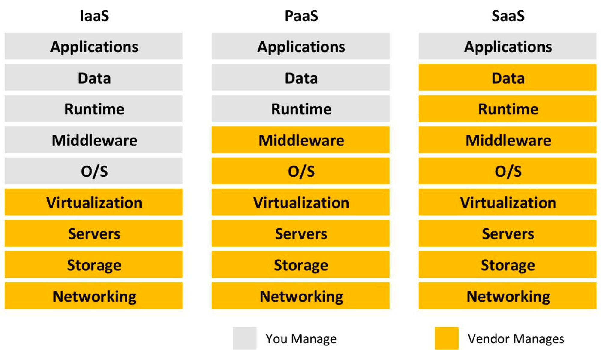

### **IaaS (Infrastructure as a Service)**

- Provides access to basic computing resources over the internet.
- Example AWS Services: EC2, Amazon S3, VPC.

### **PaaS (Platform as a Service)**

- Provides a platform that allows developers to create, distribute and run their applications.
- Example AWS Services: AWS Elastic Beanstalk, AWS App Runner, AWS OpsWorks.

### **SaaS (Software as a Service)**

- Completed applications delivered to users over the Internet and typically accessed through a web browser.
- Example AWS Services: Amazon Chime, AWS WorkDocs, Amazon Connect.

### **FaaS (Function as a Service)**

- It is a serverless computing model, allowing users to distribute individual functions.
- Example AWS Service: AWS Lambda.

## **AWS Lightsail**

- AWS Lightsail is a cloud computing service that allows users to quickly and easily launch virtual private servers.
- It's easier to predict costs thanks to optimized plans that come with a fixed monthly fee.
- Provides the ability to quickly launch projects with pre-configured application and development stacks.
- Private IP address provides easy access to basic features such as fixed storage, data transfer, DNS management.
- Wordpress, MySQL, Virtual Private Server, block and object storage, load balancer, CDN

## **AWS Glue**

- AWS Glue is a fully managed service for performing ETL (Extract, Transform, Load) operations in the cloud.
- It has the ability to automatically discover data sources and create data catalogs.
- Provides direct integration with popular data stores, thus facilitating data mobility.
- It has a serverless structure and does not require any extra effort in scaling and server management.

## **AWS Macie**

- AWS Macie is the security service used to automatically discover and classify sensitive information in data stored on AWS.
- Helps meet requirements such as compliance with personal data protection regulations.
- Powered by machine learning, this service provides insights into data at risk.
- It has the ability to identify suspicious or risky activities by analyzing user activities and API calls.

## **AWS Control Tower**

- AWS Control Tower enables you to automatically apply best practices when creating and managing multiple accounts and workloads on AWS.
- Essentially simplifies the setup and management of multi-account AWS environments.
- Allows you to create new accounts securely and compliantly using predefined "blueprints" for organizations.
- Makes it easy to track and control how users and teams use AWS services and resources.

## **AWS OpsWorks**

- AWS OpsWorks is an application management service for configuration management platforms such as Chef and Puppet.
- It allows you to create automatic procedures to scale and back up your applications and ensure inter-application coordination.
- Allows you to define how software will be installed, configured, and how tasks will be managed based on specific lifecycle events.
- The service is particularly suitable for those who want to automate configuration, management and deployment for complex application architectures.

## **AWS Transit Gateway**

- AWS Transit Gateway allows you to connect different Amazon VPCs and on-premise networks through a centralized routing service.
- It can connect thousands of VPCs and on-premises networks through a single gateway, thus it has advanced security and routing features such as monitoring traffic on your network connections and defining routing policies.
- Provides a simple and scalable solution for managing large numbers of VPCs and network connections in your organization.

## **AWS Pinpoint**

- AWS Pinpoint is a service designed to improve user interaction and communication; It analyzes users' in-app activities and helps you create targeted campaigns.
- Allows you to interact with users across various channels such as email, SMS, in-app notifications and push notifications.
- Real-time analytics features allow you to monitor and optimize user behavior and campaign effectiveness.
- Helps you increase user engagement and improve user conversion rates by creating customized messages.

## **AWS Secrets Manager**

1. Enables applications, automated processes, and other AWS services to securely access confidential information.
2. Provides a simple and automated way to return, manage and retrieve confidential information.
3. It has the capacity to store sensitive data such as passwords and API keys for integration into AWS services or databases.
4. Thanks to integration with AWS KMS (Key Management Service), confidential information is protected with strong encryption.

## **AWS Service Catalog**

1. Makes it easier for organizations to define and deploy approved IT services.
2. It allows controlling the version management and lifecycle management of IT services from a central location.
3. Enables users to create AWS resources by selecting from pre-approved product and service catalogs.
4. Offers the ability to manage templates and services from a central location to optimize costs and compliance

## **AWS Service Control Policy (SCP)**

1. Provides the ability to limit permissions to AWS accounts within the organization.
2. When defined at the top level of AWS Organization, it affects all child accounts.
3. It offers the opportunity to define permissions as whitelist or blacklist.
4. When used to limit access permissions to AWS resources, SCPs combine with IAM policies to create effective permissions.

## **AWS CloudHSM**

1. It is a service to keep hardware-based crypto keys safe.
2. Used to meet compliance requirements (FIPS 140-2 level 3 compliant).
3. Offers customers a private, isolated HSM access.
4. Provides the ability to integrate with AWS services (e.g. Amazon RDS, Amazon S3).

CloudHSM is designed for applications with high performance and security requirements, especially for cryptographic operations.

## **AWS Key Management Service (KMS)**

- KMS is a service that allows customers to manage their cryptographic keys and encrypt data using these keys. With KMS you can create, rotate, manage and use keys. KMS is used to provide data encryption in AWS services and applications.

## **AWS Elastic MapReduce (EMR)**

1. It is a scalable cloud computing platform for big data processing tasks.
2. It can analyze data using popular frameworks such as Apache Hadoop and Apache Spark.
3. Optimizes costs for data analysis by easily scaling workloads.
4. It can process petabytes of data quickly and securely.

## **AWS Security Team**

1. Used to communicate with AWS's security expert team.
2. Can be used to provide information about possible security breaches, weaknesses or suspicious activities.
3. Provides rapid response and resolution to critical security issues.

## **AWS Concierge team**

1. AWS Enterprise Support is a dedicated support service for its customers.
2. Used to get AWS-specific architectural advice or in-depth technical information.
3. This team provides guidance on how to best use AWS solutions.

## **AWS Abuse team**

1. Used to report issues regarding misuse of AWS resources or violations of the AWS Terms of Service.
2. May be used to report spam, phishing or other malicious activity.
3. Provides rapid response and intervention.

## **AWS Customer Service team**

1. The first point of contact for general AWS support and customer service.
2. Used for billing, account issues, or general questions about how to use AWS.
3. Provides service to ensure customer satisfaction.

## AWS Health Dashboard

- A personalized View of Service Health
- Proactive Notifications
- Detailed Troubleshooting Guidance

## **AWS CloudFormation**

1. It is a service that allows users to model and tune AWS resources.
2. Allows you to distribute and structure collections of resources automatically and consistently through templates.
3. Change sets feature is used to see template changes; so you can see what will change before confirming the changes.
4. It carries out resource creation, updating and deletion processes in an automatic, secure and traceable manner.

**Benefits**

1. CloudFormation allows you to model your entire infrastructure in a text file. This template becomes the single source of truth for your infrastructure. This helps you to standardize infrastructure components used across your organization, enabling configuration compliance and faster troubleshooting.
2. AWS CloudFormation provisions your resources in a safe, repeatable manner, allowing you to build and rebuild your infrastructure and applications, without having to perform manual actions or write custom scripts. CloudFormation takes care of determining the right operations to perform when managing your stack, and rolls back changes automatically if errors are detected.
3. Codifying your infrastructure allows you to treat your infrastructure as just code. You can author it with any code editor, check it into a version control system, and review the files with team members before deploying into production.
4. CloudFormation allows you to model and provision, in an automated and secure manner, all the resources needed for your applications across all regions and accounts.

## AWS Compute Services / Resource

1. Amazon EC2 (Elastic Compute Cloud)
2. AWS Lambda
3. AWS Elastic Beanstalk
4. Amazon EC2 Auto Scaling
5. Amazon Lightsail
6. AWS Batch
7. AWS Fargate
8. AWS Outposts
9. AWS ECS
10. AWS Serverless Application Repository
11. AWS Wavelength
12. AWS Local Zones
13. EC2 Image Builder

## CapEx - OpEx

Capital expenditures (CapEx) are a company's major, long-term expenses, while operating expenses (OpEx) are a company's day-to-day expenses. Examples of CapEx include physical assets such as buildings, equipment, and machinery. Examples of OpEx include employee salaries, rent, utilities, and property taxes.

**CapEx (Capital Expenditure):**

- It refers to expenses made for long-term investments.
- For example, upfront expenses incurred to purchase company assets such as physical servers, data centers, network equipment.
- By using AWS, you can minimize such large capital expenditures because you do not need to make large upfront investments for physical infrastructure.

**OpEx (Operational Expenditure):**

- It refers to expenses incurred for daily business operations.
- Recurrent expenses such as electricity, maintenance, licenses and personnel costs.
- When using AWS, spending on managing your infrastructure can turn into OpEx because you only pay for what you use and can scale as per requirements.

## EC2 instance pricing varies depending on many variables

- The buying option (On-demand, Savings Plans, Reserved, Spot, Dedicated)
- Selected instance type
- Selected Region
- Number of instances
- Load balancing
- Allocated Elastic IP Addresses
- Auto scaling

## AWS Services Reserve Include

- EC2
- DynamoDB
- ElastiCache
- RDS
- RedShift

## **Amazon Simple Storage Service (S3) Pricing**

- **Storage class** – e.g., Standard or IA.
- **Storage quantity** – data volume stored in your buckets on a per GB basis.
- **Number of requests** – the number and type of requests, e.g., GET, PUT, POST, LIST, COPY.
- **Lifecycle transitions requests** – moving data between storage classes.
- **Data transfer** – data transferred out of an S3 region is charged.

## **AWS Partner Paths**

**1- Software Path**

The Software Path is for organizations that develop software that runs on or is integrated with AWS.

**2- Hardware Path**

The Hardware Path is for organizations that develop hardware devices that work with AWS.

**3- Services Path**

The Services Path is for organizations that deliver consulting, professional, managed, and value-added resale services.

**4- Training Path**

The Training Path is for organizations that sell, deliver, or incorporate AWS training.

**5- Distribution Path**

The Distribution Path is for organizations that recruit, onboard, and support their partners to resell and develop AWS solutions.

## AWS Outposts

1. AWS Outposts brings Amazon Web Services (AWS) cloud infrastructure, services, APIs, and tools to your own data center and lets you run them locally.
2. Provides a consistent hybrid experience both in the cloud and in your own data center.
3. It offers high data processing, data storage and analysis capabilities locally with AWS's wide range of services.

## **Amazon Cloud Directory**

1. **Description:**
     - Amazon Cloud Directory is a service that provides a scalable and flexible directory structure for a wide range of hierarchy-based data applications. It allows you to create multidimensional indexes and establish relationships between these indexes.
2. **Highlights:**
     - **Flexibility:** Ability to create custom indexes with flexible schemas for applications with multiple hierarchies.
     - **Scalability:** Scalable structure with large amount of objects and relationships.
     - **Fine-Grained Access Control:** Ability to set detailed policies to control access to content.
     - **History Tracking:** Ability to track the version history of objects and relationships within the directory.
    

## Amazon AppStream 2.0

1. Amazon AppStream 2.0 is an AWS service used to publish applications on the cloud and provide access to users through their browsers.
2. This service allows users to use applications from different devices without the need to install any software.
3. Thanks to the scalability offered, it offers seamless performance to many users at the same time.

## Amazon WorkSpaces

1. Amazon WorkSpaces is an AWS service that offers virtual desktops in the cloud.
2. Users can access these virtual desktops securely from any device.
3. It is used for businesses to manage and scale employees' computers in a centralized and secure manner.

## Amazon QuickSight

1. Amazon QuickSight is a fully managed, scalable business intelligence (BI) service.
2. It allows users to analyze data and create visualizations on the cloud.
3. It has the ability to connect quickly and directly to many data sources.

## AWS Global Accelerator

1. Amazon Global Accelerator is a service offered by AWS to optimize the internet traffic of your applications and provide faster and more reliable access to users.
2. Speeds up connections to applications by routing traffic through AWS's global network infrastructure.
3. Provides access to resources in different AWS regions via a single instant IP address.
4. AWS Global Accelerator provides static IP addresses that act as a fixed entry point to your applications
5. AWS Global Accelerator is a good fit for non-HTTP use cases

## AWS DataPipeline

1. Amazon Data Pipeline is a web service that automates data movement and transformation tasks between different AWS services and on-premises data sources.
2. This service has the ability to plan and manage data movement and transformation at regular intervals.
3. Users can define data processing workflows and automatically run these workflows at specific time intervals.

## Amazon PrivateLink

1. Amazon PrivateLink enables you to access AWS services, AWS Marketplace applications, and AWS-supported services through private connections.
2. This service keeps traffic data privately and securely in your Amazon VPC without circulating it across the internet.
3. Users can thus connect to their VPCs and on-premises environments privately and securely.

## **Amazon Detective**

- A service that provides AWS users with a deeper understanding of security incidents and threats.
- Used to investigate events and attacks by analyzing data from sources such as AWS CloudTrail and VPC Flow Logs.
- Makes it easier to understand potential security issues by providing visualizations, graphs, and analysis.

## **AWS Directory Service**

- AWS Directory Service allows organizations to manage Active Directory or LDAP-based directory services in the AWS cloud environment. This service is used to control access to organizations' cloud resources, facilitate authentication, and manage their users (Microsoft Active Directory).
- AWS Directory Service for Microsoft Active Directory, also known as AWS Microsoft AD, uses secure Windows trusts to enable users to sign in to the AWS Management Console, AWS Command Line Interface (CLI), and Windows applications running on AWS using their existing corporate Microsoft Active Directory credentials.

## **AWS Service Quotas**

- Sets limits and quotas for the use of AWS services.
- It is necessary to prevent excessive use of resources and maintain service quality.
- Helps you consider these constraints when scaling or designing your workloads.
- Offers customized quotas for each service and the possibility of increasing them on demand.
- AWS Management Console allows you to make quota requests using the AWS CLI or APIs.

## AWS Infrastructure Automation Tools

- **AWS CloudFormation**
- **AWS OpsWorks**
- **AWS Elastic Beanstalk**
- **AWS CodeStar**
- **AWS Systems Manager**
- **AWS CodeDeploy**
- **AWS Proton**
- **AWS Fargate**

## AWS Site-to-Site VPN

- AWS Site-to-Site VPN is a service that allows companies to establish a private and secure network connection between their data centers and Amazon Virtual Private Cloud (Amazon VPC). This connection is made reliably and securely over the internet using IPsec VPN tunnels.
- Virtual Private Gateway (VGW), Transit Gateway, Customer Gateway

##AmazonFSx

Amazon FSx is one of AWS's file-based storage services.

1. **Amazon FSx for Windows File Server**:
     - **Windows File Systems**: It is a fully managed, scalable and Windows compatible file storage service.
     - **SMB Protocol**: Supports the SMB (Server Message Block) protocol, which facilitates direct integration with Windows-based applications.
     - **AD Integration**: Integrates with Microsoft Active Directory, so you can use your existing authentication and access controls.
     - **Data Backup and Restore**: Provides automatic backup and easy restore features.
2. **Amazon FSx for Lustre**:
     - **High Performance**: Lustre is a popular open source file system designed for high-performance computing (HPC) workloads.
     - **For Big Data and HPC**: Ideal for HPC applications such as big data analysis, machine learning, financial modelling.
     - **Amazon S3 Integration**: FSx for Luster can directly integrate with Amazon S3. This allows you to process data from S3 directly in Luster.
     - **Scalability**: It offers scalable and extremely fast storage capacity according to your needs.
    

## AWS Application Discovery Service

- AWS Application Discovery Service is designed for businesses planning to migrate from on-premises data centers to AWS. This service automatically identifies applications, servers and their dependencies running on your existing infrastructure. This allows you to carry out the migration process in a more conscious, organized and smooth way.

## Amazon VPC Flow Logs

- Amazon VPC Flow Logs is a feature for monitoring traffic through network interfaces within Amazon Virtual Private Cloud (VPC). This traffic can be over Elastic Network Interfaces (ENI), between VPC peering connections, or over VPN connections between AWS and the customer.

## Amazon SWF

- Amazon Simple Workflow Service (Amazon SWF) is a service from AWS that helps coordinate workflow and provide state management for applications. SWF is designed for interoperable, multi-step applications with distributed components and services.

## AWS Organizations

- Centrally manage policies across multiple AWS accounts
- Govern access to AWS services, resources and regions
- Automate was account creation and management
- Consolidate billing across multiple AWS accounts
- Control access to AWS services.

## VPC Endpoint

AWS VPC (Virtual Private Cloud) Endpoint is a feature that provides a private connection to AWS services and VPC private resources directly from your VPC. This ensures that your access to AWS services is through Amazon's private network and not over the internet.

## VPC Endpoint Gateway

VPC Endpoint Gateway allows you to access some of Amazon's services (especially Amazon S3 and Amazon DynamoDB) from within Amazon VPC via a direct private network connection. This means accessing these services without using an internet gateway, NAT device, VPN connection, or AWS Direct Connect.

## VPC Interface Endpoint

VPC Interface Endpoint is a private network port within AWS VPC. This endpoint acts as a private Elastic Network Interface (ENI) inside your Amazon VPC and is associated with a private IP address. This allows you to establish a private connection with specific AWS services and VPC endpoint services.

## AWS Managed Key

- **AWS managed key** - AWS managed keys are KMS keys in your account that are created, managed, and used on your behalf by an AWS service integrated with AWS KMS.

## AWS Owned Key

- AWS owned keys are a collection of KMS keys that an AWS service owns and manages for use in multiple AWS accounts. Although AWS owned keys are not in your AWS account, an AWS service can use an AWS owned key to protect the resources in your account.

## DDoS Attack Protection for Web Applications

- ELB
- CloudFront
- Route 53
- Global Accelerator

## AWS Application Migration Service (MGN)

- AWS Application Migration Service makes it easy for organizations to quickly, securely and seamlessly migrate to AWS, accelerating modernization projects and reducing overall cost.

## AWS Database Migration Service (DMS)

- AWS DMS helps organizations accelerate database migration projects, reduce risk, and minimize disruption during migration. This is invaluable for companies looking to move workloads to AWS, consolidate, or switch database platforms.

## AWS Migration Hub

- AWS Migration Hub helps you maintain integrity and visibility while running multiple migration projects simultaneously. This is valuable for organizations that want to manage their migration processes simply, quickly and effectively.

## AWS CloudFront Use Cases

- Static asset caching
- Live & on-demand video streaming
- Security
- Customizable content delivery with Lambda@Edge
- Dynamic content & API acceleration
- Software distribution

## To estimate the costs of an Amazon CloudFront

- Traffic Distribution
- Requests
- Data Transfer Out

## AWS Professional Services

- AWS Professional Services combines deep expertise and practice to help organizations accelerate their cloud journeys, reduce risk, and leverage best practices.
- Dedicated Technical Account Manager (TAM)
- Fast Response Times
- Infrastructure Event Management (IEM)
- Education and Educational Resources
- Access to AWS's Extensive Tools

## AWS Concierge Support

- AWS Concierge Support provides guidance and consultancy services on technological issues and special projects outside of AWS. This is particularly valuable for maximizing technology investments and adopting best practices for non-AWS technologies.
- Technology Consultancy
- Personalized Support
- Integration Help
- Strategic planning
- Project Management

## To help secure your AWS resources, follow the best practices in using your AWS Identity and Access Management (IAM) service

- Lock Away Your AWS Account Root User Access Keys
- Create Individual IAM Users
- Use Groups to Assign Permissions to IAM Users
- Grant Least Privilege
- Get Started Using Permissions with AWS Managed Policies
- Use Customer Managed Policies Instead of Inline Policies
- Use Access Levels to Review IAM Permissions
- Configure a Strong Password Policy for Your Users
- Enable MFA
- Use Roles for Applications That Run on Amazon EC2 Instances
- Use Roles to Delegate Permissions
- Do Not Share Access Keys
- Rotate Credentials Regularly
- Remove Unnecessary Credentials
- Use Policy Conditions for Extra Security
- Monitor Activity in Your AWS Account

## Security in the cloud

1- **Implement a strong identity foundation**
2- **Enable traceability**
3- **Apply security at all layers**
4- **Automate security best practices**
5- **Protect data in transit and at rest**
6- **Keep people away from data**
7- **Prepare for security events**

## When you want to reduce the costs of Amazon EBS consider the following

- Delete Unattached Amazon EBS Volumes
- Resize or Change the EBS Volume Type
- Delete Stale Amazon EBS Snapshots

## Three options to control access to an Amazon S3 Bucket

- IAM Policies
- Bucket Policies
- Bucket ACLs

## The AWS Marketplace provides value to buyers in several ways

- It simplifies software licensing and procurement with flexible pricing options and multiple deployment methods. Flexible pricing options include free trial, hourly, monthly, annual, multi-year, and BYOL.
- Customers can quickly launch pre-configured software with just a few clicks, and choose software solutions in AMI and SaaS formats, as well as other formats.
- It ensures that products are scanned periodically for known vulnerabilities, malware, default passwords, and other security-related concerns.

## Amazon Elastic Transcoder

- Amazon Elastic Transcoder is a media transcoding service. It is designed to be a highly scalable, easy-to-use, and cost-effective way to convert (or transcode) media files from their source format into versions that will play back on devices like smartphones, tablets, and PCs.

## AWS Acceptable Use Policy (AUP)

- The AWS Acceptable Use Policy describes prohibited uses of the web services offered by AWS. For example, any activities that are illegal, that violate the rights of others, or that may be harmful to others are prohibited. If a customer violates the policy or authorizes or helps others to do so, AWS may suspend or terminate their use of the services.

## AWS Free Security Resources

- AWS Security Blog
- Whitepapers
- AWS Developer Forums
- Articles and Tutorials
- Security Bulletins
- Compliance Resources and Testimonials.

## AWS Federation

With Federation, you can use single sign-on (SSO) to access your AWS accounts using credentials from your corporate directory. Federation uses open standards, such as Security Assertion Markup Language 2.0 (SAML), to exchange identity and security information between an identity provider (IdP) and an application.

AWS offers multiple options for federating your identities in AWS:

- AWS Identity and Access Management (IAM)
- AWS IAM Identity Center (Successor to AWS Single Sign-On)
- AWS Directory Service

## AWS Compute Optimizer

AWS Compute Optimizer recommends optimal AWS resources for your workloads to reduce costs and improve performance by using machine learning to analyze historical utilization metrics. Over-provisioning resources can lead to unnecessary infrastructure costs, and under-provisioning resources can lead to poor application performance. Compute Optimizer helps you choose optimal configurations for three types of AWS resources: Amazon EC2 instances, Amazon EBS volumes, and AWS Lambda functions, based on your utilization data.

## Customer Managed Key (CMK)

The KMS keys that you create are customer managed keys. Customer managed keys are KMS keys in your AWS account that you create, own, and manage. You have full control over these KMS keys, including establishing and maintaining their key policies, IAM policies, and grants, enabling and disabling them, rotating their cryptographic material, adding tags, creating aliases that refer to the KMS keys, and scheduling the KMS keys for deletion.

## Amazon Eventbridge

Amazon EventBridge is a service that provides real-time access to changes in data in AWS services, your own applications, and software as a service (SaaS) applications without writing code. Amazon EventBridge Scheduler is a serverless task scheduler that simplifies creating, executing, and managing millions of schedules across AWS services without provisioning or managing underlying infrastructure.

## AWS Local Zones

AWS Local Zones enable AWS to position its services close to users outside of large geographic regions (Regions), enabling users to deliver their applications to end users with low latency. Local Zones are connected to an AWS region (Region), but are close to the user's geographic location.

## AWS **Service Health Dashboard**

Service Health Dashboard is the single place to learn about the availability and operations of AWS services. You can view the overall status of AWS services, and you can sign in to view personalized communications about your particular AWS account or organization.

## AWS **Account Health Dashboard**

Account Health Dashboard, alerts are triggered by changes in the health of your AWS resources, giving you event visibility, and guidance to help quickly diagnose and resolve issues.

## Route 53 - **Choosing a routing policy**

- **Simple routing policy** – Use for a single resource that performs a given function for your domain, for example, a web server that serves content for the example.com website. You can use simple routing to create records in a private hosted zone.
- **Failover routing policy** – Use when you want to configure active-passive failover. You can use failover routing to create records in a private hosted zone.
- **Geolocation routing policy** – Use when you want to route traffic based on the location of your users. You can use geolocation routing to create records in a private hosted zone.
- **Geoproximity routing policy** – Use when you want to route traffic based on the location of your resources and, optionally, shift traffic from resources in one location to resources in another location.
- **Latency routing policy** – Use when you have resources in multiple AWS Regions and you want to route traffic to the Region that provides the best latency. You can use latency routing to create records in a private hosted zone.
- **IP-based routing policy** – Use when you want to route traffic based on the location of your users, and have the IP addresses that the traffic originates from.
- **Multivalue answer routing policy** – Use when you want Route 53 to respond to DNS queries with up to eight healthy records selected at random. You can use multivalue answer routing to create records in a private hosted zone.
- **Weighted routing policy** – Use to route traffic to multiple resources in proportions that you specify. You can use weighted routing to create records in a private hosted zone.

## AWS Market Advantages

- Speed
- Agility
- Flexible pricing
- Control and governance

## AWS Cloud Foundations

Cloud Foundations provides a guided path to help customers deploy, configure, and secure their new workloads while ensuring they are ready for on-going operations in the cloud. Cloud Foundations helps customers navigate through the decisions they need to make through curated AWS Services, AWS Solutions, Partner Solutions, and Guidance.

## AWS Security Token Service (AWS STS)

AWS Security Token Service (STS) is a web service offered by AWS for authentication and authorization. AWS STS provides short-term credentials to users or systems. This service is largely used for the need to provide temporary access to AWS resources.

## TCO Calculator

TCO Calculator is a tool that helps businesses better understand the potential cost savings of migrating to the cloud and compare current infrastructure costs to AWS cloud costs.

## AWS CodeArtifact

AWS CodeArtifact is a fully managed dependency management service provided by Amazon Web Services (AWS). This service makes it easy to store, share and distribute your code dependencies, packages and container images in a central location.

## Amazon Kinesis Data Streams

Amazon Kinesis Data Streams (KDS) is a service from Amazon Web Services (AWS) to easily collect, process, and analyze real-time big data streams.

## AWS IoT Core

AWS IoT Core is a management service from Amazon Web Services (AWS) for Internet of Things (IoT) applications. It securely collects, processes and routes data from IoT devices.

## AWS OpsHub

AWS OpsHub is a service that provides a user-friendly graphical user interface (GUI) to manage AWS Snowball devices. It allows you to create and manage Snowball jobs, track the status of your jobs, and download and upload data to and from Snowball devices.

## QuickSight Q

Amazon QuickSight Q is a query service that is a component of Amazon QuickSight. QuickSight Q is a tool you can use to explore, analyze and query your data. This service has a user-friendly interface to help you better understand your data.

## AWS Well-Architected Tool

It helps customers evaluate compliance with best practices when designing, building, and operating their AWS infrastructure. This tool is designed based on the AWS Well-Architected framework.

## Amazon Quantum Ledger Database (Amazon QLDB)

Amazon Quantum Ledger Database (Amazon QLDB) is a fully managed ledger database that provides a transparent, immutable, and cryptographically verifiable transaction log owned by a central trusted authority. Amazon QLDB can be used to track each and every application data change and maintains a complete and verifiable history of changes over time.

## Amazon Timestream

Amazon Timestream is a fast, scalable, and serverless time series database service for IoT and operational applications that makes it easy to store and analyze trillions of events per day up to 1,000 times faster and at as little as 1/10th the cost of relational databases. Amazon Timestream saves you time and costs in managing the lifecycle of time series data by keeping recent data in memory and moving historical data to a cost-optimized storage tier based upon user-defined policies.
